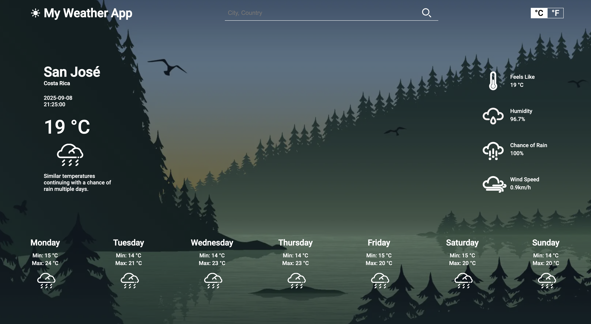

# Weather App Project

A simple weather application built with **HTML, CSS, and JavaScript** that fetches and displays weather data for a user-specified location using an external weather API.
## Installation

Follow these steps to run the project locally:

1. **Clone the repository**
   ```bash
   git clone git@github.com:Maiker260/Weather-App.git
   ```

2. **Install dependencies**
   ```bash
   cd Weather-App
   npm install
   ```

3. **Build and run**
   ```bash
    npm run dev
    npm build
   ```

4. **Open the app**  
    
## Features

**API Integration**
- Functions to fetch weather data from a chosen weather API.
- Accepts a **location** as input and returns the relevant weather data.

**Data Processing**
- Functions that process the API JSON response.
- Extracts only the required data for the application.
- Returns a clean object containing:
  - Temperature
  - Weather conditions
  - Wind speed
  - Humidity

**User Input**
- Form for users to enter a location (city, country, etc.).
- Submits the location and triggers a fetch for weather data.

**Display Weather Information**
- Dynamically updates the webpage with the fetched weather data.

## Demo

https://maiker260.github.io/Weather-App/

## Screenshots

Home Page


## Acknowledgements

- [Visual Crossing - Weather API](https://www.visualcrossing.com/resources/documentation/weather-api/timeline-weather-api/)
- MDN Web Docs for JavaScript and Fetch API guidance
- Webpack documentation for dynamic imports


## Author

- [@Maiker260](https://github.com/Maiker260)